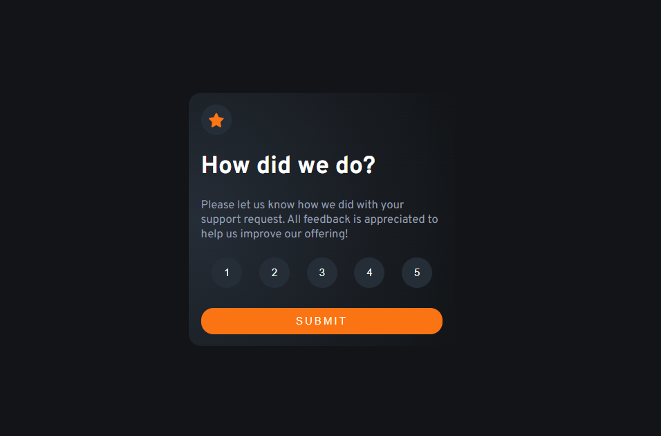

# Frontend Mentor - Interactive rating component solution

This is a solution to the [Interactive rating component challenge on Frontend Mentor](https://www.frontendmentor.io/challenges/interactive-rating-component-koxpeBUmI). Frontend Mentor challenges help you improve your coding skills by building realistic projects.

## Table of contents

-   [Overview](#overview)
    -   [The challenge](#the-challenge)
    -   [Screenshot](#screenshot)
    -   [Links](#links)
-   [My process](#my-process)
    -   [Built with](#built-with)
    -   [What I learned](#what-i-learned)
-   [Author](#author)

## Overview

### The challenge

Users should be able to:

-   View the optimal layout for the app depending on their device's screen size
-   See hover states for all interactive elements on the page
-   Select and submit a number rating
-   See the "Thank you" card state after submitting a rating

### Screenshot



### Links

-   Solution URL: [Add solution URL here](https://your-solution-url.com)
-   Live Site URL: [Add live site URL here](https://your-live-site-url.com)

## My process

### Built with

-   Semantic HTML5 markup
-   CSS custom properties
-   Flexbox
-   Mobile-first workflow

### What I learned

Firstly I did some really messed up stuff, 2 years aho lol. Anyways I made this accessible, used URLSearchParams and the form action attribute to reduce the js code.

```html
<form action="/rating.html">
    <fieldset>
        <legend class="sr-only">Rate your experience</legend>

        <div class="rating-buttons">
            <button
                class="rating-button"
                data-value="1"
                aria-pressed="false"
                type="button">
                1
            </button>
            <button
                class="rating-button"
                data-value="2"
                aria-pressed="false"
                type="button">
                2
            </button>
            <button
                class="rating-button"
                data-value="3"
                aria-pressed="false"
                type="button">
                3
            </button>
            <button
                class="rating-button"
                data-value="4"
                aria-pressed="false"
                type="button">
                4
            </button>
            <button
                class="rating-button"
                data-value="5"
                aria-pressed="false"
                type="button">
                5
            </button>
        </div>
    </fieldset>
    <input type="hidden" name="rating" id="rating" />
    <button type="submit" class="submit">Submit</button>
</form>
```

```css
:root {
    --orange: hsl(25, 97%, 53%);
    --white: hsl(0, 0%, 100%);
    --light-grey: hsl(217, 12%, 63%);
    --medium-grey: hsl(216, 12%, 54%);
    --dark-blue: hsl(213, 19%, 18%);
    --very-dark-blue: hsl(216, 12%, 8%);
}

@font-face {
    font-family: "Overpass";
    src: url("../assets/Overpass-VariableFont_wght.ttf");
}
```

```js
const params = new URLSearchParams(window.location.search);
const rating = document.getElementById("rating");
console.log(params);
const rating_value = params.get("rating");
console.log(rating_value);
rating.textContent = rating_value;
```

is project in the future.\*\*

## Author

-   Website - [LinkedIn](https://linkedin.com/heslopd23)
-   Frontend Mentor - [@dylan-dot-c](https://www.frontendmentor.io/profile/dylan-dot-c)
